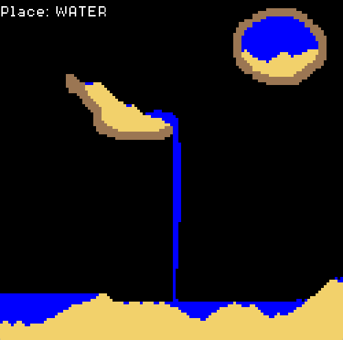

# Particle Game
Particle Game is a sandbox game where you can place particles such as dirt, 
sand, and water. Each particle behaves differently, so place them around and 
see how they interact with each other!

This is a little project I made over the course of a weekend to get more 
familiar with the C programming language, and mostly serves as a reference to 
myself for future projects. Check out 
[retrorain](https://github.com/aCallin/retrorain) if you want to see something 
more impressive.

## Controls
__Left mouse__: place particles

__Right mouse__: delete particles

__Scroll wheel__: change particle selection (_displayed at the top left_)

## Building / Running
This project was built on the command line using gcc 12.1.0. The makefile I 
used to build the project is included and should work out of the box.

You can otherwise directly play the game by executing _Particle Game.exe_.